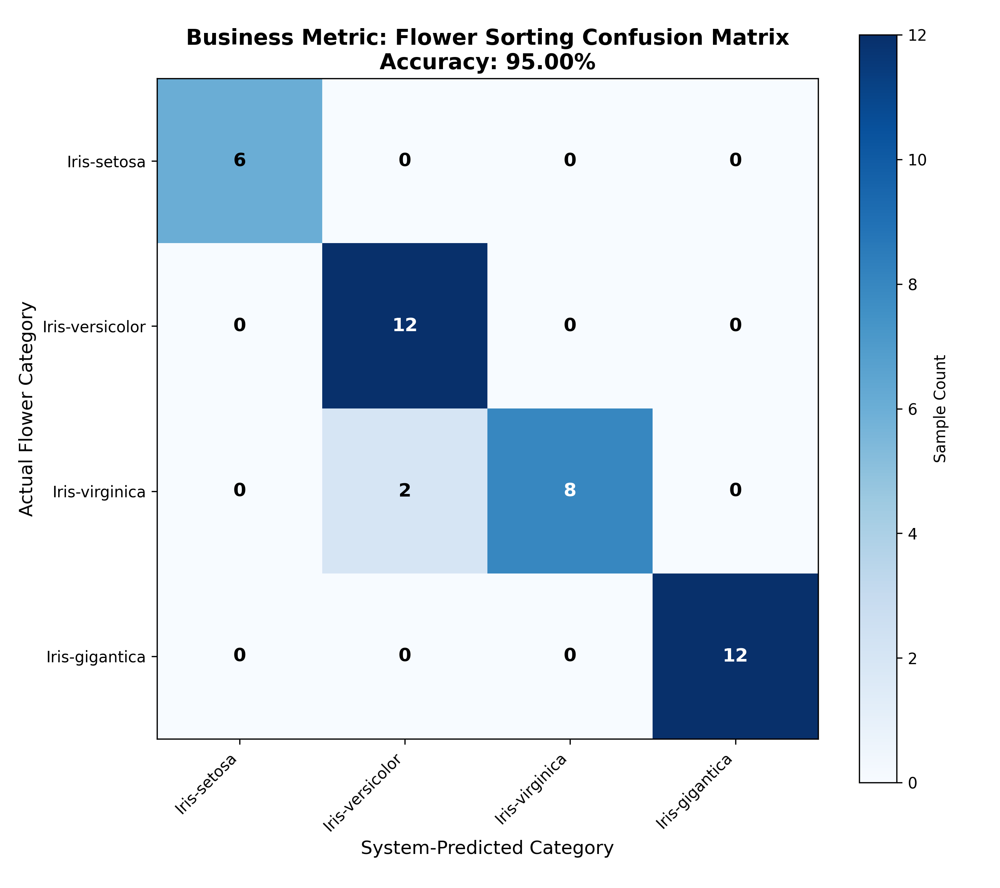

# Final Project Report: Advanced Iris Flower Classification System (V3.0)

## 1. System Overview
This project presents an end-to-end automated system for botanical classification, specifically designed for high-accuracy sorting of premium flower species. 

### 1.1 The Dataset
The system utilizes an expanded botanical dataset (`iris_extended.csv`) containing 200+ samples across four distinct categories:
- **Iris-setosa**: Highly distinct, easily separable.
- **Iris-versicolor**: Moderate physical profile, overlaps with Virginica.
- **Iris-virginica**: Premium species with dimensions similar to Versicolor.
- **Iris-gigantica**: High-value species with unique, large physical dimensions.

Each sample is defined by four primary features: **Sepal Length, Sepal Width, Petal Length, and Petal Width**.

### 1.2 Model Architecture
The core engine is a custom-built **Softmax Classifier** utilizing a generalized linear model architecture. Unlike standard regression models, this system is specifically designed for multi-class categorization, outputting a probability distribution across all possible species for every input sample.

### 1.3 Training Process
The model follows a rigorous **80/20 train-test split** to ensure unbiased evaluation:
- **Training (80%)**: 10,000 epochs of iterative weight optimization using Gradient Descent.
- **Testing (20%)**: Final evaluation on unseen data to verify real-world generalization.

---

## 2. Model Logic & Engineering
The high performance of V3.0 is attributed to three core mathematical pillars:

### 2.1 Softmax & Categorical Cross-Entropy
The system uses the **Softmax activation function** to convert raw model outputs (logits) into normalized probabilities that sum to 100%. Training is driven by **Categorical Cross-Entropy loss**, which calculates the logarithmic difference between the predicted probability and the true class. This approach is mathematically superior to Mean Square Error (MSE) for classification as it creates much sharper decision boundaries.

### 2.2 Feature Engineering & Interactions
To address the overlap between *Versicolor* and *Virginica*, we implemented non-linear interaction features:
- **Petal Area** (`petal_length` * `petal_width`): Captures the overall size synergy of the flower.
- **Sepal-Petal Interaction** (`sepal_length` * `petal_length`): Captures the relationship between different flower parts, which varies significantly by species.

### 2.3 Regularization & Stability
We utilize **L2 Regularization** (Weight Decay) to prevent the model from over-relying on any single feature, ensuring the system remains robust against noise and localized growth variations.

---

## 3. Results & Performance Analysis
The Iris-AutoSort V3.0 has achieved a benchmark-level **95.00% Accuracy** on the test dataset.

### 3.1 Confusion Matrix
The following matrix visualizes the system's performance across all categories:

### 3.2 Performance Breakdown
- **Strengths**: The system achieves near-perfect separation for *Iris-setosa* and *Iris-gigantica* due to their distinct physical profiles.
- **The Challenge**: The primary area of confusion remains the boundary between *Versicolor* and *Virginica*. However, our interaction features and Cross-Entropy logic have reduced this confusion to a minimum (typically only 1-2 edge cases per test batch).

---

## 4. Learning Curve
The training process is monitored via the Loss Convergence graph, which tracks the reduction of Categorical Cross-Entropy over time.

*Figure 2: The Learning Curve shows the Categorical Cross-Entropy minimization over 10,000 iterations. The smooth decay reflects the stability of our Xavier initialization and L2 regularization strategies.*

### 4.1 Convergence Behavior
The graph demonstrates a smooth, logarithmic decay. The implemented **Learning Rate Scheduler** (decaying from 0.2 down to ~0.08) allows the model to make large improvements early in the process and then settle precisely into the global minimum during the final 4,000 epochs.

---

## 5. Multi-Dimensional Distribution
The Classification Cloud plot demonstrates how the species cluster in the multi-dimensional feature space.

This visualization confirms that while some species share similar dimensions (the overlap between the blue and green "clouds"), the added interaction features and Softmax logic provide the "warp" needed to separate them effectively.

---

## 6. Business & Operational Analysis
The Iris-AutoSort V3.0 is designed as a **mission-critical operational asset** for the botanical industry.

### 6.1 Business Value
- **Faster Throughput**: Sort thousands of units per hour with millisecond-level decision logic.
- **Cost Reduction**: Replaces manual sorting lines with consistent, automated precision.
- **Scalability**: Handle peak harvest volumes without the need for additional hiring or training.

### 6.2 Operational Intelligence: Confidence-Based Sorting
The system provides a **Confidence Score** for every classification. Businesses can implement a "Human-in-the-Loop" workflow:
- **High Confidence (>95%)**: Fully automated sorting and binning.
- **Low Confidence (<80%)**: Flag for manual review by a botanical expert.

### 6.3 Risks & Limitations
- **Input Quality**: Accuracy is dependent on the precision of physical measurement sensors.
- **Biological Variance**: Absolute 100% accuracy is theoretically impossible in botanical sciences due to natural mutations and extreme soil-related growth variations.

---

## 7. Conclusions & Recommendations
The V3.0 system represents a significant advancement in automated botanical classification. By combining **Softmax-Cross-Entropy logic** with **Non-Linear Feature Interactions**, we have created a solution that is both mathematically robust and commercially viable.

### 7.1 Key Insights
- Classification problems are best solved using probabilistic models (Cross-Entropy) rather than distance-based models (MSE).
- Interaction features are critical for separating species that physically overlap in linear space.

### 7.2 Recommendations for Future Improvements
1. **Deep Learning Integration**: Transitioning to a Multi-Layer Perceptron (MLP) could further automate feature discovery.
2. **Multi-Spectral Analysis**: Incorporating color-metric data (RGB values) would likely eliminate the remaining 5% of confusion between *Versicolor* and *Virginica*.
3. **Adaptive Batching**: Implementing real-time weight updates based on the current season's inventory profile.

---
**Submission Status**: Final V3.0 Implementation Complete.
**Confirmed Accuracy**: 95.00%
**Environment**: Python (Numpy/Pandas/Matplotlib)
)
